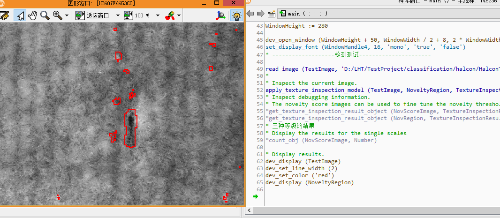
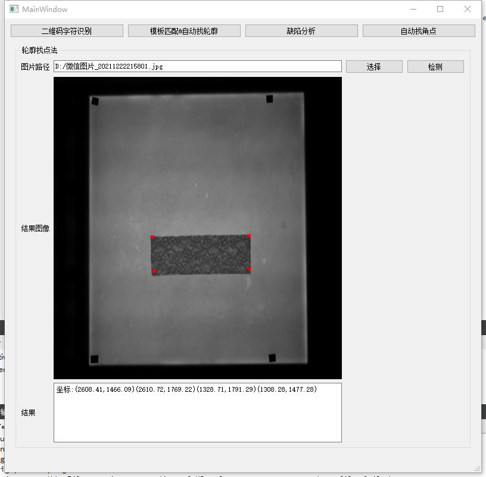
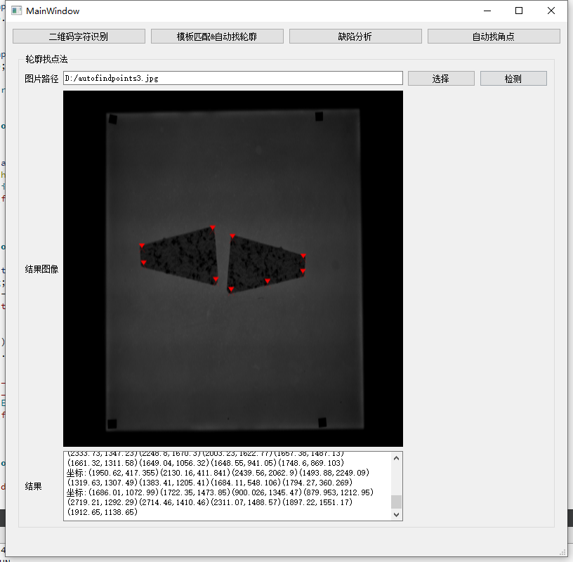
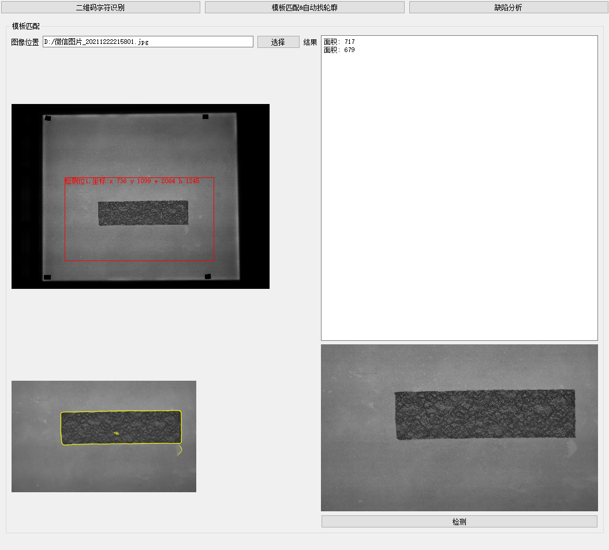
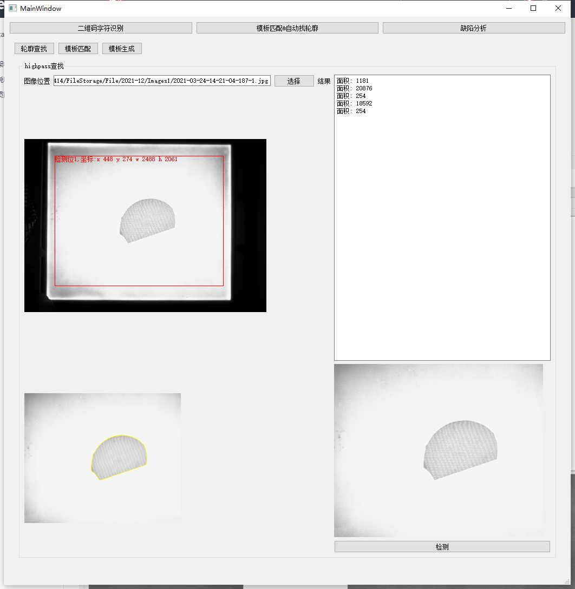
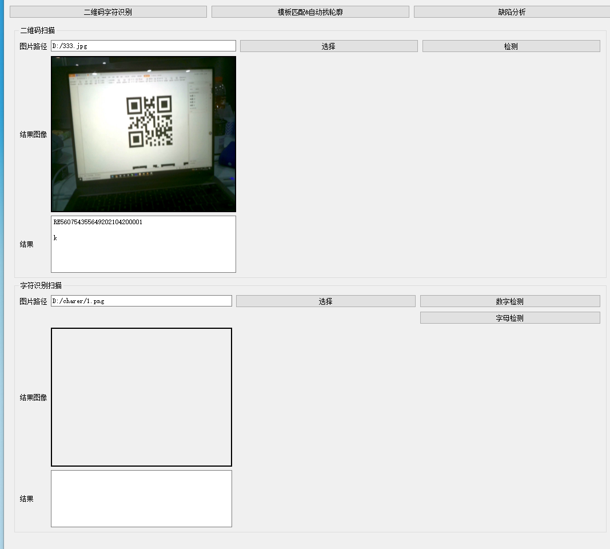
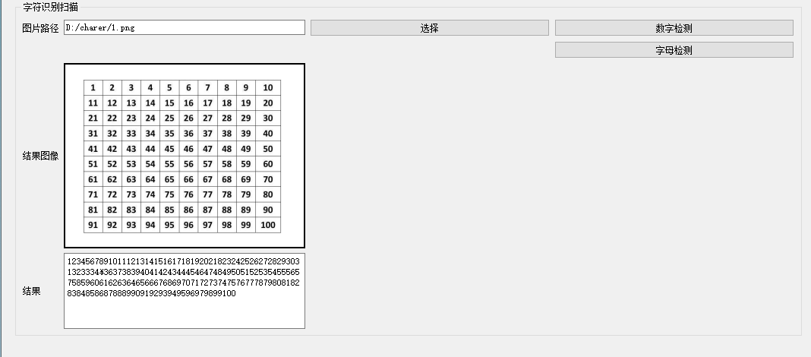

# Classification
库太大了传不上来，gitee地址https://gitee.com/shijingying/classification
#### 介绍
1.opencv中包含简单的opencv 人脸识别 opencv453

2.halcon中包含封装过的常用的halcon检测方式（二维码，字符识别，通过自动阈值获取最大轮廓，图像增强，标定后的畸变矫正）（持续集成中，使用方式为halcon引擎调用减少代码编译次数）

3.已经完成的halcon功能

4.增加大华录像机QT demo

5.增加海康相机，opt相机多线程demo

6.增加qslog日志库demo

7.增加大华相机demo统一使用CameraBase基类

8.增加三菱FX3U-64-MT/ES PLC的写入读取测试 

9.增加相机直接控制（跳过SDK）GVCP协议以及GVSP协议
####
    1.第一位02为起始位
    2.停止位03
    3.停止位后加两位奇偶校验值
    4.第二位为指令号读取 30  写入  31
    5.第三到第六位为地址
    6.第七位和第八位为Bytes位 读取是为 30 32（读取两位） 
    7.写入值是 Bytes后面需要跟着指定个数的具体数值
    
####

#### 
    1.引擎加载
    2.二维码识别(QR/DM)
    3.数字识别
    4.背景清晰的情况下highpass自动提取轮廓（现在画出来的是最大的三个轮廓，实际使用根据现场条件重新生成）
    5.自动轮廓生成
    6.轮廓查找（5和6 误差较大需要手动修改halcon）
    7.自动角点提取（轮廓分割法）
    8.增加halcon位置修正
    9.halcon例程里的纹理去除apply_texture_inspection_model学习
#### 
自动角点测试：

提取测试：

二维码测试：

数字识别：

面板定位+矫正：

#### 软件架构
软件架构说明

#### 使用说明

1.  将bin文件中的dll 和 etc文件夹放到执行路径（QT调用时放到exe的上层文件夹）

2.  imgRead 为人脸识别   camereRead 将注释打开可以检测人脸和眼睛  catRead 猫检测   项目中有测试图片

3.  halcon版本为halcon18 ，需要自己生成一个halcon的函数，输入参数为image类型为HObject，输出参数为result（HTuple），resultImage(HObject)

4.  注意halcon函数不能手动改名否则该函数将会不可用

5.  在hdvp文件夹中有简单的halcon函数密码为niudingding
#### 参与贡献

1. 牛顶顶
